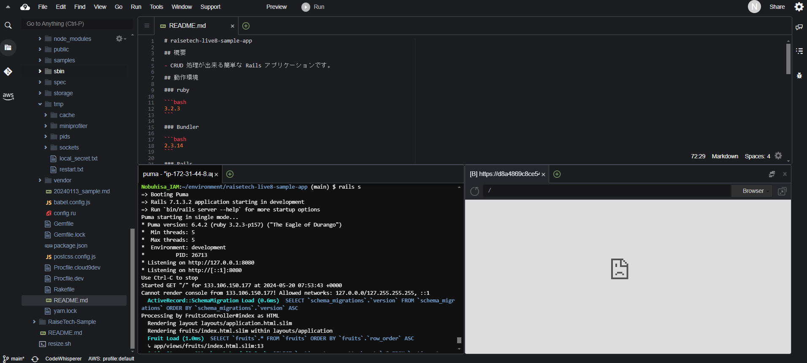
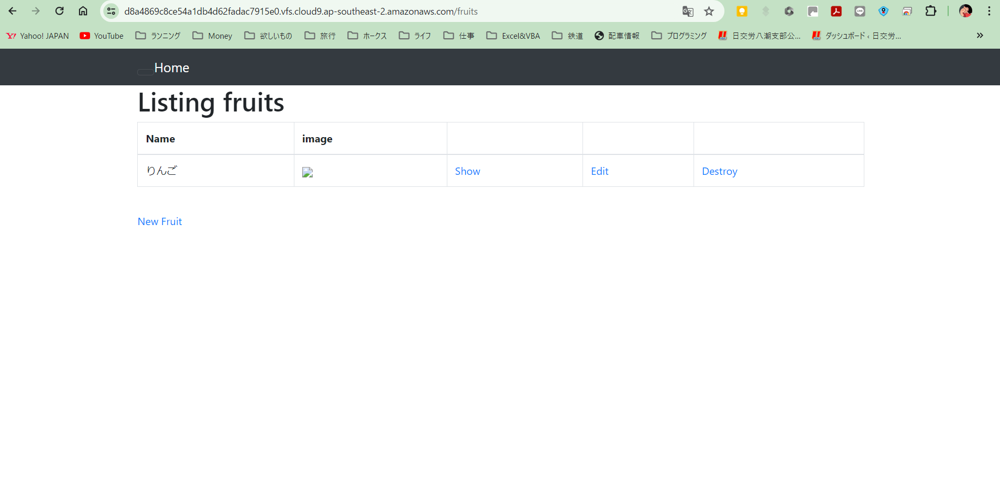
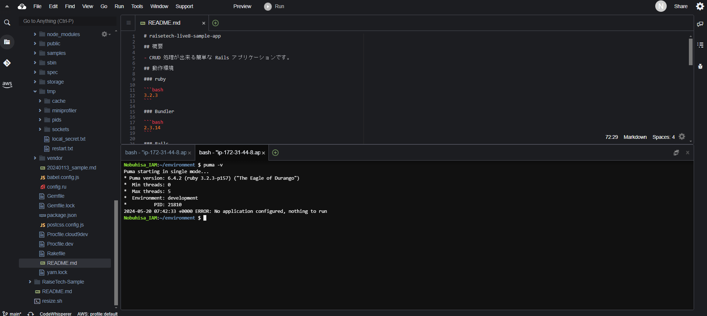
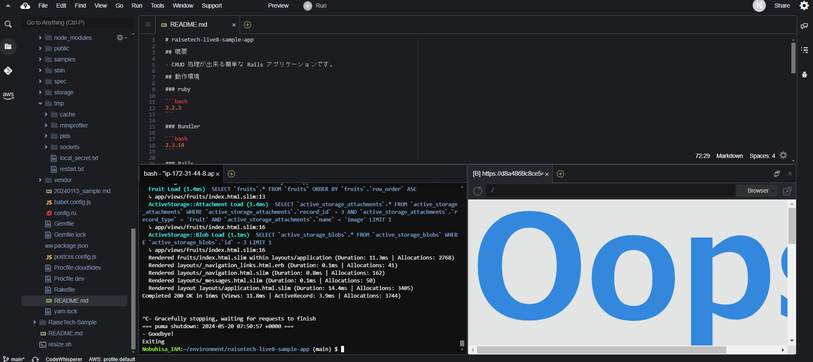
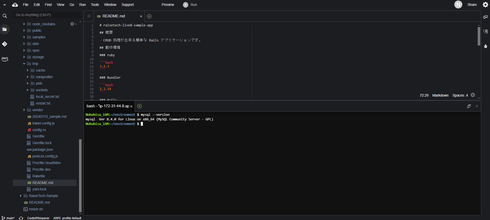
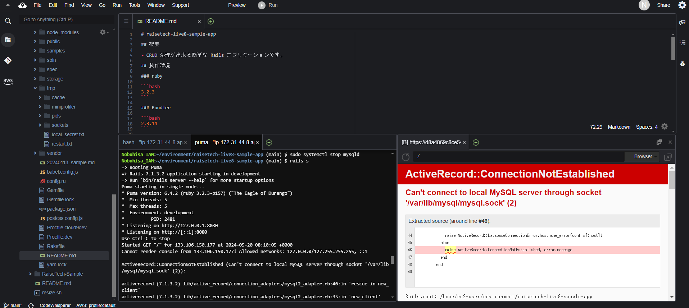

## 第3回課題

### 1. サンプルアプリケーションの起動

（ブラウザで起動し、「りんご」を登録した状態）
 

### 2. APサーバーについて
1. APサーバーの名前およびバージョンの確認

   `Puma ver6.4.2`

2. APサーバーを終了させた場合のアクセス確認

### 3. DBサーバーについて
1. DBサーバーの名前およびバージョンの確認

   `MySQL ver8.4.0`
   

2. DBサーバーを終了させた場合のアクセス確認

3. Rails構成管理ツールの名前

   `Bundler`

### 4. 学びと感想
* （サンプルのような）シンプルなアプリを一つ動かすために、これほど多くのプロセスが潜んでいるとは知らず、正直驚きました。
* デプロイのプロセスを理解するのに相当の時間（過去3回分の録画講義を繰り返し視聴）を要してしまいましたが、回り道をした分だけブラウザでのアクセスに成功した時の達成感が大きかったです。
* 学習の速度が思うように上がらず、焦りやいら立ちを覚えることも多々ありますが、これからも泥臭く取り組んでいきたいと思います。
