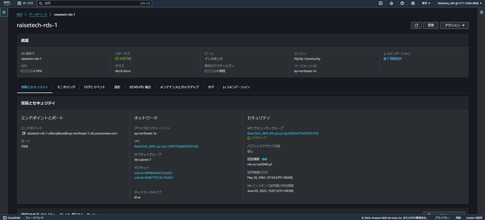
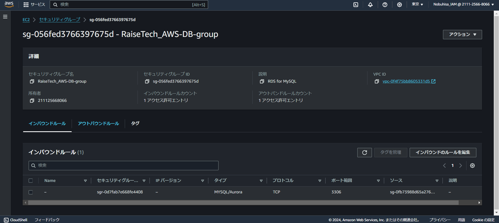
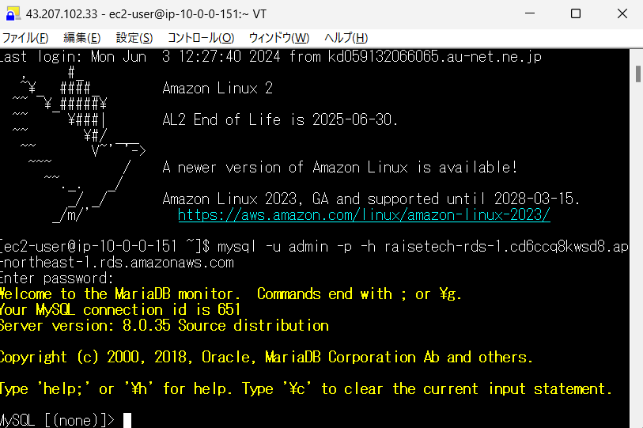

## 第4回課題

### 1. VPCの作成
* ウィザードを利用し、`VPC`、`サブネット`、`ルートテーブル`、`IGW`を構築

### 2. EC2およびRDSの構築
1. EC2

* `パブリックサブネット-1a`上に作成し、さらに`キーペア`を作成

* セキュリティグループを作成し、インバウンドルールを設定

2. RDS

* `プライベートサブネット-1a`および`-1c`からなるサブネットグループを作成し、そのグループ上にRDSを作成

* RDS用のセキュリティグループを作成し、インバウンドルールを設定

### 3. EC2からRDSへの接続
1. Tera Termを起動し、EC2のパブリックIPアドレス、ユーザー名、および作成済みのキーペアを入力し、EC2にSSH接続する

2. MySQLをインストールした後、エンドポイントおよびマスターパスワードを入力し、RDSに接続する

### 4. 学びと感想
* 一見シンプルに見えた課題でしたが、いざ取り組んでみると想定以上の苦労の連続でした。（第3回で壁を越える経験をしていなかったら、心が折れていたかもしれません。）EC2-SSH接続、そしてEC2-RDS接続に成功したときはそれぞれ張りつめていたものが解け、体の力が抜けそうな感覚を味わいました。
* VPCの作成はVPCウィザードに頼りっぱなしでした。理解を深めるためには手動での作成にもトライする必要がありそうです。
* 課題の中ではEC2およびRDSは無料の利用枠内で収まる設定にしてあるとはいえ、これに甘んじずコスト意識を持って、少なくとも作業終了時のEC2停止だけは忘れないように気を付けます。
* 学習開始から親しんだCloud9を離れることに若干の戸惑いもありましたが、作業環境の移行も今回の課題の一つ、ひいては成長の機会と前向きに捉え、また次の山（課題）に向かっていきたいと思います。
